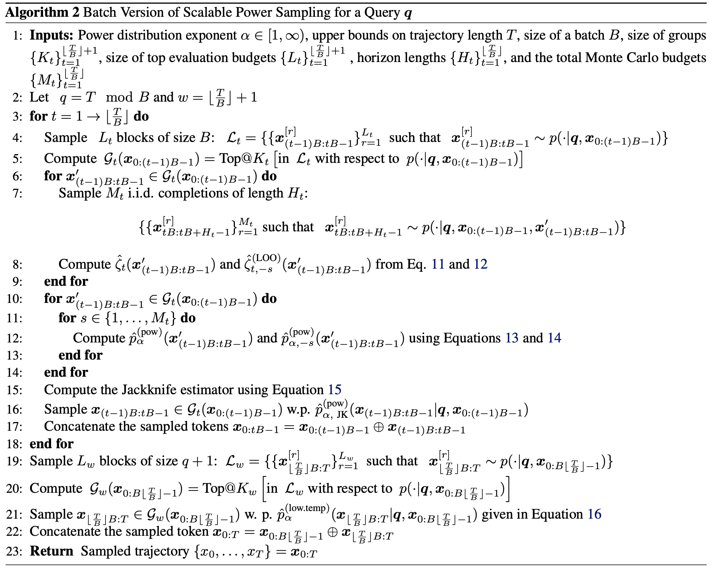
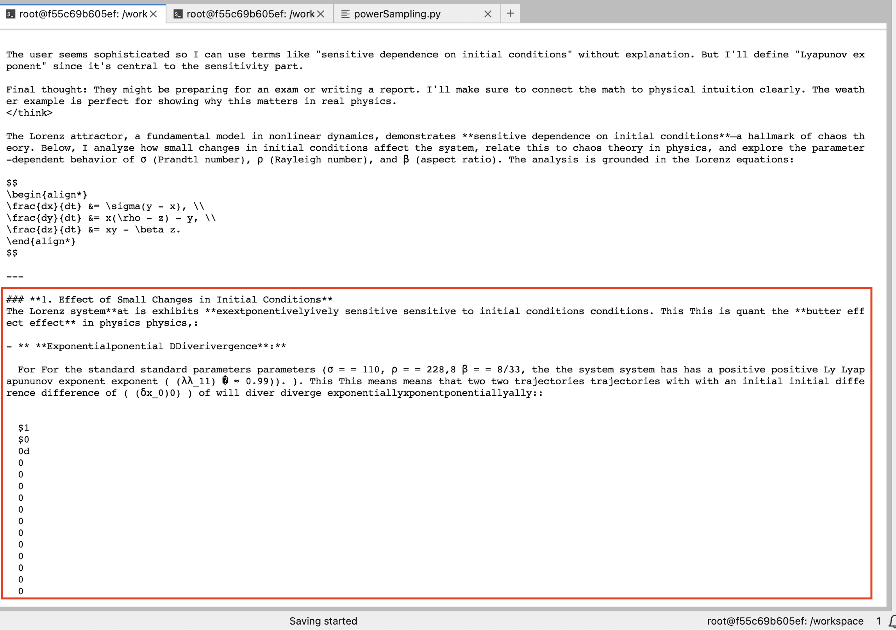
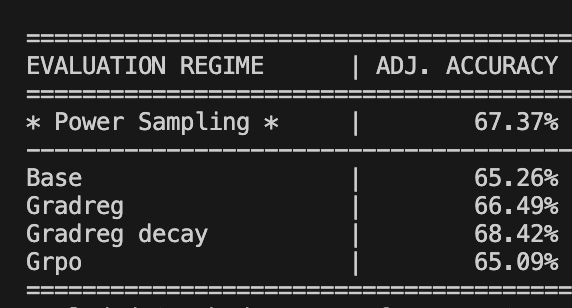

## Motivation
[The paper](https://arxiv.org/pdf/2601.21590) I chose for this project was a very exciting extension of the results formalized in recent literature (https://arxiv.org/pdf/2504.13837, https://arxiv.org/pdf/2506.02355, https://arxiv.org/pdf/2511.19942, among others), which collectively point towards the same thing - that one of the primary function of Reinforcement Learning (RL) is to increase the likelihood of "correct" tokens. That is to say, it operates primarily within the same latent manifold as your typical pre-training regime (in that it doesn't induce any *new* knowledge); rather, it serves to "sharpen" or hone capabilities that already existed within the weights, but were dormant in a sense. These result became more  contentable to me upon doing an empirical deep dive [myself](https://daksh-dangi.github.io/stackin-paper/articles/evaluating-grad-reg/) into activations across layers within a base model and it's GRPO counterpart.

I chose this paper in particular because I wanted to de-mystify how RL actually affects the mechanisms of a Language Model, and seeing firsthand the "sharpening" effect seemed like the right place to start. Moreover, it seemed like a fun test for me to attune myself to the rigorous inference time indexing (cache + atn mask) that would be needed when undertaking this implementation; something that I had taken for granted while using inference engines like vLLM. Truthfully - I took this more as an exercise than as a rigorous research project like the others I've done. It also served to satiate some of my aggrievances that I had indicated in my [very first article](https://daksh-dangi.github.io/stackin-paper/articles/grad-reg/), where I talked about how I was overwhelmed by the extensive list of PyTorch functions and objects. Through the process of implementing this paper, I became a lot more confident in my grasp of manipulating vectorized objects and the basics of PyTorch as a whole. I also became intimately aware of the true impact of vLLM's Paged Attention, as I saw firsthand the problem that it was solving.

## Approach Formalization
Now, back to the paper itself. Prior work in this area seemed to have approached this "sharpening" property of RL with a somewhat brutish design - with early work focusing on temperature based sampling methods that scale token-level probabilities to sharpen distributions, called [low-temperature sampling](https://arxiv.org/pdf/2012.13575) (note: this paper came out in 2020, prior to RL becoming popularized within the NLP space. My earlier comment was more of a segue into Power Sampling, which in turn references this method). While this approach outperformed the baseline across evals (in retrospect, looking at evals from 6 years ago shows how far the community has come.. I mean using perplexity as an eval metric for learned knowledge??), it was clearly lacking in many areas; and it motivated further extrapolations in the form of power distributions. Now, power distributions also function under a similar core premise, in that it scales token level probabilitites by a factor of alpha. However, it does so in a manner that induces global, trajectory level reweighting of probabilitites; in contrast to the temporally local reweighting that low-temperature sampling does.

Put simply, if low-temperature sampling pushed the distribution in favor of likely outcomes at a *local* token level, power distributions would re-weight the local distribution to reflect outcomes from future trajectory probabilities. Even if a token had lower probabilitites at the immediate next time step, if it resulted in a higher probability trajectory in the future, power sampling would reweight it in accordance to this likelihood shift. It is in this manner through which we are able to replicate levels of performance that match RL-trained models through no explicit training.

That is easier said than done, though. MCMC sampling is not that straightforward, since the normalization constant Z in this scenario is computationally intractable - it requires summing over every possible sequence of tokens in the length of the horizon. To put this into perspective, assuming a horizon length of merely 50 tokens & operating on an LLM with a modest 32,000 token vocabulary, the normalization term would consist of 32000^50, or $1.83\times10^{225}$ terms. There are "only" $10^{80}$ atoms in the observable universe. To tackle this, an MCMC variant called Metropolis-Hastings is adopted by the paper to approximate sampling from the unnormalized distribution

This paradigm, however, assumes the same pitfalls that ail any MCMC based algorithms at higher dimensions - exponential mixing times. Even using the workaround soution proposed in the [initial paper](https://arxiv.org/pdf/2510.14901) by sampling from intermediate distributions (essentially chunking the entire trajectory length into shorter Horizons), the lookahead results in an almost **8.8x** inference time increase compared to regular sampling methods ! We are matching/exceeding RL performance, but at what cost ? This is where [Scalable Power Sampling](https://arxiv.org/pdf/2601.21590) enters the picture. 

The authors of this paper functionally approximate the MCMC lookahead by providing a direct correlation between low-temperature sampling and the power distribution - a scaling factor 𝛇 (applied to the low-temperature sampled distribution), which reflects the expected powered likelihood of future completions. This, in turn, is calculated via an MC approximation by generating M i.i.d completions conditioned on the input and the previously generated sequence as shown below.

$$
\hat{p}_{\alpha}^{\text{pow}}(x_t \mid \mathbf{q}, \mathbf{x}_{0:t-1}) = \frac{p^{\alpha}(x_t \mid \mathbf{q}, \mathbf{x}_{0:t-1}) \ \hat{\zeta}_t(x_t)}{\sum_{x_t' \in \mathcal{V}} p^{\alpha}(x_t' \mid \mathbf{q}, \mathbf{x}_{0:t-1}) \ \hat{\zeta}_t(x_t')} \tag{1}
$$

where $\hat{\zeta}_t(x_t')$ is given by:

$$
\hat{\zeta}_t(x_t') = \frac{1}{M_t} \sum_{r=1}^{M_t} p^{\alpha-1}(\mathbf{x}_{t+1:T}^{[r]} \mid \mathbf{q}, \mathbf{x}_{0:t-1}, x_t') \tag{2}
$$

Crucially, as stated in the Scalable Power Sampling paper, "this [zeta] decomposition localises the global, trajectory-level dependence of the power distribution into a per-token scalar term, explaining both why MCMC-based methods were previously required and how they can be avoided". Through the process of this localization, the scaling factor is formulated as an expectation **under the base model**, which allows us to perform (relatively) inexpensive autoregressive Monte Carlo sampling ! This distinction is *very* important, as the alternative would be to sample from the intractable power distribution *directly* via MH-MCMC. This sidesteps the intractable normalization sum, but the issue of exponential mixing times still remain due to the high dimensionality. Zeta sidesteps all of this entirely.

The ${\zeta}$ term on its own isn't a biased estimator (given a sufficiently sized M); however, once it's introduced into **Equation 1**, the estimator becomes a ratio of random variables (zeta appears in both the numerator and denominator); and since the ratio of expectations does not equal the expectation of ratios, bias is induced into the resulting estimator of the power distribution. To remediate this, the paper introduces a Jackknife Estimator which "removes the leading-order bias term while preserving the overall computational structure".

With the foundations set, I began writing the code. Some things were underspecified in the batched algorithm provided in the paper's Appendix, so I took the liberty of making a few educated guesses on the matter. I worked in Block sizes of 50 up to a trajectory length of 2880, as that was the vRAM limit that I found for my hardware. Furthermore, I added an early stopping mechanism - whereupon predicting the </think> token, the model would switch to regular temperature + frequency scaled sampling. My rationale for this was the model would have done most of the computational heavy-lifting within it's <think> tags, so having it perform the intense MC sampling even after the answer had been rationalized was unnecessary.

## Results
It took me a little bit to familiarize myself with the indexing mechanisms and creating views to deal with the abstracted batch size, but I got there in the end (with Gemini providing a critical overview of my implementation intermittently). The most annoying part served to be the attention mask - which didn't *throw any errors* if misaligned, however, it completely demolished any semblance of semantic understanding within the model. Below is one such instance where my attention mask implementation was misaligned, and the resulting text.

Overall, the results were interesting - though I must concede that they are **not** well generalized. I only ran 1 experiment using Qwen3-4B, once again due to budgeting issues. It outperformed everything except for the Gradient Regularized regime with Decay from my previous project. Crucially, the model also did OOM on 4 questions, so these results are with those questions omitted from each model's score. Three out of the four questions that it OOM'd on were correct for the other models, so it's not the case that difficult questions were omitted to paint a prettier picture. The results illustrate that the method has some merit to it, but deeper, more rigorous validation would be required to substantially prove anything.

## Future Work
As a final note, I would like to point out that there is a lot I would like to continue down this avenue. There are so many things I left unexplored - hyperparamters related to trajectory + horizon size, block size, number of samples, etc. Not only that, but taking an empirical deep dive into each step - how the probability distributions are affected at each time step, and attributing "ah-ha!" moments to specific token choices. Or potentially even using this to create a dataset of reasoning traces to then perform on policy distillation for CPT/SFT ! That way, the sharpened distribution could slowly be distilled back into the model weights. All extremely interesting in their own rights, but simply too computationally expensive for me to carry out at the moment.